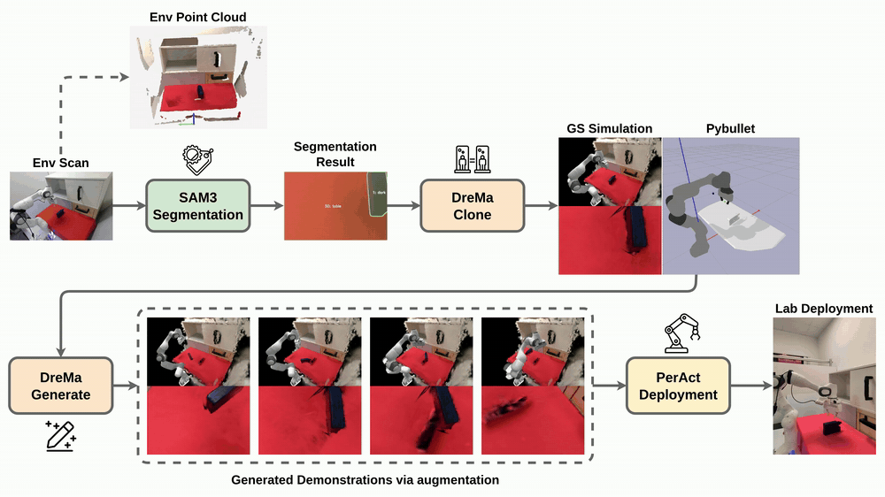
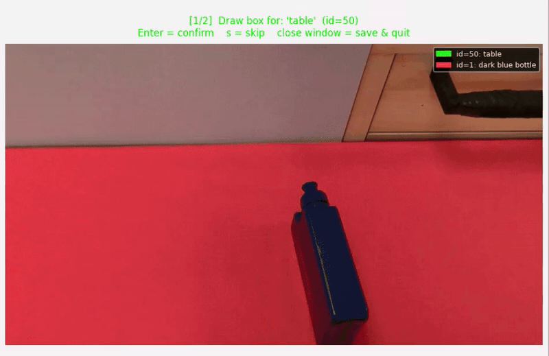
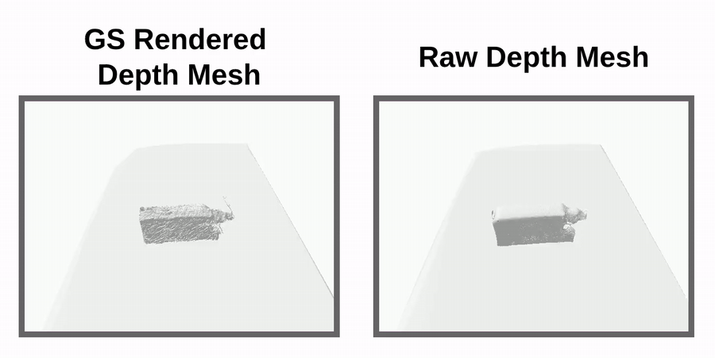

# DreMa Freiburg Extension

This is a fork of [DreMa (ICLR 2025)](https://dreamtomanipulate.github.io/) developed as part of a master's project at the **University of Freiburg** by Berke Ceylan.

> For the original DreMa codebase readme see [Original README](docs/original_drema_instructions.md).

The goal of this project was to take DreMa to a complete real-robot pipeline: collecting data with a Franka Panda, building the Gaussian splatting world model, generating augmented demonstrations, and training and deploying a PerAct policy back on the real robot.



## Extensions & Improvements
The main extensions over the original codebase, needed to deploy and evaluate DreMa on a real Franka Panda in Freiburg:

### Real-world data collection (`robot_scanner/`)
End-to-end automated data collection for the Franka Panda. Supports several movement patterns such as Bézier arch, orbit, line-scan, random-pose and GELLO replay, and handles camera–robot calibration, pose recording in DreMa format and depth saving.

### Point cloud aggregation
`robot_scanner/tools/pointcloud_aggregation.py` fuses the recorded RGB-D frames into a single world-frame point cloud. This is a quick way to check that a scan is accurate and complete, and the same cloud later serves as the reference for mesh evaluation.

### SAM3 segmentation backend
Integrated Meta's [SAM3](https://github.com/facebookresearch/sam3) as the segmentation backend (the original paper used DEVA). Everything is configured in `configs/segmentation.yaml` via the `method` field:

- `grounded_sam`: GroundingDINO + SAM, text-prompted, per-frame
- `sam3`: SAM3 image model, text-prompted, per-frame
- `sam3_video`: SAM3 video tracker, **visual-prompted**, propagates across all frames

For `sam3_video`, first run `tools/pick_visual_prompts.py` to draw bounding boxes on one frame (the middle frame by default, or set `prompt_frame`). Then `run_segmentation.py` propagates these prompts through the whole video and writes the masks.



### Mesh quality improvement
The original paper extracts meshes from GS-rendered depth, which inherits the noise and incompleteness of the rendering so its not ideal for PyBullet interaction.

We feed the raw RealSense depth directly into TSDF fusion instead. Mesh quality is measured with bidirectional Chamfer distance against the aggregated point cloud (`tools/eval_mesh_quality.py`); on our scenes this brought the mean recall error from ~10mm down to ~6mm.



### Dual-camera setup
The simulation renders both the wrist camera (RealSense D415) and the overhead camera (Azure Kinect) with matching real-world calibration, including per-step wrist extrinsics. This fixes the wrist-camera rendering mismatch of the original release and gives PerAct two consistent views in both training and deployment.

### PerAct training & deployment
The generated episodes are converted to PerAct's input format through our [RLBench fork](https://github.com/berkecyln/RLBench) (no CoppeliaSim needed), and our [PerAct fork](https://github.com/berkecyln/peract) trains directly on them. The trained policy runs both inside the DreMa simulation (`simulate_peract.py`) and on the real robot (`deploy_peract.py`).

## Main Scripts

In pipeline order:

```bash
# 1. data collection
python robot_scanner/run.py                        # automated RGB-D + pose recording
python run_segmentation.py                         # object masks (SAM3 video)

# 2. simulation setup
python create_simulation.py                        # extract Gaussians, meshes, URDFs
python simulate.py                                 # inspect the reconstructed scene

# 3. data generation
python tools/prepare_scene_for_generation.py       # convert recording, add camera fields, create aux pkl files
python generate_new_data.py                        # generate augmented episodes (wrist + overhead)

# 4. training: run train.py from our PerAct fork on the generated data

# 5. deployment
python simulate_peract.py                          # trained policy inside the DreMa simulation
python deploy_peract.py                            # trained policy on the real robot
```

## Credits

- **DreMa**: [Dream to Manipulate, Barcellona et al., ICLR 2025](https://dreamtomanipulate.github.io/) (University of Padova & University of Amsterdam). This repository builds directly on their codebase.
- **PerAct**: [Shridhar et al., CoRL 2022](https://peract.github.io/), trained and deployed through our [fork](https://github.com/berkecyln/peract).
- **RLBench**: [James et al.](https://github.com/stepjam/RLBench), data conversion through our [fork](https://github.com/berkecyln/RLBench).
- **robot_io**: robot control and camera interface by the [Robot Learning Lab, University of Freiburg](https://github.com/acl21/robot_io), with our extensions in [berkecyln/robot_io](https://github.com/berkecyln/robot_io).
- **3D Gaussian Splatting**: [Kerbl et al., SIGGRAPH 2023](https://repo-sam.inria.fr/fungraph/3d-gaussian-splatting/).
- **SAM 3**: [Meta AI](https://github.com/facebookresearch/sam3), used for object segmentation.
- **GELLO**: [Wu et al.](https://wuphilipp.github.io/gello_software/), teleoperation device used to record the manipulation demos.
